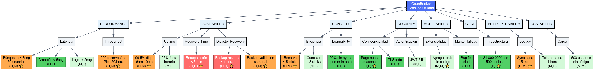

# REPORTE DE EVALUACIÓN ATAM - COURTBOOKER
## Sistema de Reservas de Canchas Deportivas

**Equipo de Evaluación:**
- Arquitecto Evaluador Principal: [Externo al proyecto]
- Arquitecto del Proyecto: [Nombre]
- Facilitador ATAM: [Nombre]

**Stakeholders Participantes:**
- Product Manager / Dueño del Negocio
- Arquitecto de Software
- Tech Lead
- Representante de Operaciones
- Representante de Usuarios (club deportivo)

**Fecha de Evaluación:** [DD/MM/YYYY]  
**Duración:** 2 días (16 horas)  
**Ubicación:** [Ciudad]

---

## TABLA DE CONTENIDOS

1. [Resumen Ejecutivo](#1-resumen-ejecutivo)
2. [Paso 1-2: Contexto y Drivers de Negocio](#2-paso-1-2-contexto-y-drivers-de-negocio)
3. [Paso 3: Presentación de la Arquitectura](#3-paso-3-presentación-de-la-arquitectura)
4. [Paso 4: Enfoques Arquitecturales](#4-paso-4-enfoques-arquitecturales)
5. [Paso 5: Árbol de Utilidad](#5-paso-5-árbol-de-utilidad)
6. [Paso 6: Análisis de Escenarios](#6-paso-6-análisis-de-escenarios)
7. [Paso 7-8: Brainstorming y Re-análisis](#7-paso-7-8-brainstorming-y-re-análisis)
8. [Paso 9: Resultados y Hallazgos](#8-paso-9-resultados-y-hallazgos)
9. [Plan de Acción](#9-plan-de-acción)
10. [Conclusiones](#10-conclusiones)

---

## 1. RESUMEN EJECUTIVO

### 1.1 Propósito de la Evaluación

Evaluar la arquitectura propuesta para CourtBooker, un sistema de reservas de canchas deportivas, para validar que cumple con los requisitos de negocio y atributos de calidad críticos antes de proceder con la implementación completa.

### 1.2 Hallazgos Principales

**Fortalezas identificadas:**
- ✅ Arquitectura Service-Based apropiada para el tamaño del equipo
- ✅ Uso de cache (Redis) bien justificado para performance
- ✅ Integración con sistema legacy bien pensada (Adapter pattern)

**Riesgos críticos identificados:**
- ⚠️ **RIESGO-01 (ALTO):** Base de datos compartida es single point of failure para availability
- ⚠️ **RIESGO-02 (MEDIO):** Cache warm-up puede causar degradación temporal de performance
- ⚠️ **RIESGO-03 (MEDIO):** Integración SOAP con sistema legacy no tiene fallback

**Trade-offs aceptados:**
- Cache mejora performance pero introduce eventual consistency (ACEPTABLE)
- Service-Based reduce complejidad operacional vs microservicios pero limita granularidad de escalado (ACEPTABLE)

**Recomendación:** **PROCEDER** con implementación con mitigaciones para riesgos identificados.

---

## 2. PASO 1-2: CONTEXTO Y DRIVERS DE NEGOCIO

### 2.1 Contexto del Negocio

**Descripción del Sistema:**

CourtBooker es un sistema de reservas online para un club deportivo universitario en Bogotá, Colombia, que gestiona canchas (fútbol, tenis, baloncesto). El sistema permite a socios reservar canchas, gestionar membresías, y procesar pagos.

**Situación Actual:**
- Sistema manual con llamadas telefónicas y planilla Excel
- ~200 reservas/semana
- 450 socios activos
- Pérdida estimada de 30% de revenue por reservas no capturadas fuera de horario de oficina

**Objetivos del Proyecto:**
1. Incrementar revenue 40% en primer año (capturar reservas 24/7)
2. Reducir carga administrativa 60% (automatización)
3. Mejorar experiencia de usuario (self-service, pagos online)
4. Base para expansión a otros clubes (franquicia)

**Restricciones:**

| Restricción | Valor                                 | Justificación |
|-------------|---------------------------------------|---------------|
| **Presupuesto** | $1.000.000/mes infraestructura        | Presupuesto aprobado por junta directiva |
| **Timeline** | 6 meses para MVP                      | Temporada alta inicia en 6 meses |
| **Equipo** | 3 desarrolladores                     | Equipo interno disponible |
| **Legacy** | Integrar sistema universitario (SOAP) | No se puede reemplazar, inversión reciente |

### 2.2 Drivers Arquitecturales (ASRs)

Los siguientes requisitos fueron identificados como **Architecturally Significant Requirements**:

#### DR-01: Performance - Disponibilidad en Tiempo Real
- **Descripción:** Los socios deben ver disponibilidad de canchas en tiempo real
- **Métrica:** Respuesta < 3 segundos P95 para búsqueda de disponibilidad con 50 usuarios concurrentes
- **Prioridad:** ALTA
- **Justificación:** Socios deciden reservar basándose en disponibilidad inmediata; latencia alta = abandono

#### DR-02: Availability - Sistema Crítico en Horario Pico
- **Descripción:** Sistema debe estar disponible especialmente en horarios pico de reserva
- **Métrica:** 99.5% uptime durante horarios pico (6am-10pm, lunes-domingo)
- **Prioridad:** ALTA
- **Justificación:** Downtime en horario pico = reservas perdidas, impacto directo en revenue

#### DR-03: Usability - Self-Service para Socios
- **Descripción:** Socios deben poder reservar sin intervención de administrador
- **Métrica:** 90% de reservas completadas sin soporte en primera semana post-lanzamiento
- **Prioridad:** ALTA
- **Justificación:** Reducir carga administrativa es objetivo clave

#### DR-04: Security - Protección de Datos de Pago
- **Descripción:** Datos de pago deben estar seguros, cumplir con regulaciones
- **Métrica:** Cumplir con PCI-DSS Level 3, Ley 1581 (Colombia)
- **Prioridad:** ALTA
- **Justificación:** Requisito legal, riesgo reputacional

#### DR-05: Modifiability - Extensión a Otros Clubes
- **Descripción:** Arquitectura debe soportar multi-tenancy para franquicia futura
- **Métrica:** Agregar nuevo club sin cambios de código, solo configuración
- **Prioridad:** MEDIA
- **Justificación:** Objetivo de expansión a 2 años

#### DR-06: Cost - Presupuesto de Infraestructura
- **Descripción:** Costos operacionales deben mantenerse dentro de presupuesto
- **Métrica:** ≤ $1.000.000 USD/mes para 500 miembros, 1,000 reservas/semana
- **Prioridad:** ALTA (Hard constraint)
- **Justificación:** No hay flexibilidad presupuestal, proyecto no viable si excede

#### DR-07: Interoperability - Integración con Sistema Legacy
- **Descripción:** Debe integrarse con sistema Universitario existente (SOAP)
- **Métrica:** Solicitud de autenticación y validación de datos al momento en que ingresa un usuario al sistema
- **Prioridad:** ALTA
- **Justificación:** Sistema legacy contiene datos críticos de miembros de la universidad

---

## 3. PASO 3: PRESENTACIÓN DE LA ARQUITECTURA

### 3.1 Decisión Arquitectural Principal

**Estilo:** Service-Based Architecture (no monolito, no microservicios)

**Justificación:**
- Equipo pequeño (3 devs) → microservicios sería overhead excesivo
- Necesidad de separar responsabilidades → monolito sería rígido
- Service-Based: balance entre modularidad y simplicidad operacional

### 3.2 Servicios Identificados

#### Service 1: **Booking Service**
- **Responsabilidad:** Gestión de reservas de canchas
- **Funciones clave:**
    - Consultar disponibilidad en tiempo real
    - Crear/modificar/cancelar reservas
    - Validar reglas de negocio (horarios, límites por socio)
- **Tecnología:** Node.js + Express
- **Base de datos:** PostgreSQL (tabla: bookings, courts, time_slots)

#### Service 2: **Payment Service**
- **Responsabilidad:** Procesamiento de pagos
- **Funciones clave:**
    - Integración con Wompi (pasarela de pagos Colombia)
    - Generación de facturas electrónicas
    - Registro de transacciones
- **Tecnología:** Node.js + Express
- **Base de datos:** PostgreSQL (tabla: payments, invoices)
- **Cumplimiento:** PCI-DSS Level 3

#### Service 3: **User Service**
- **Responsabilidad:** Autenticación y gestión de usuarios
- **Funciones clave:**
    - Login/logout
    - Gestión de perfiles de socios
    - Roles y permisos
- **Tecnología:** Node.js + Express
- **Base de datos:** PostgreSQL (tabla: users, roles)

#### Service 4: **Integration Service**
- **Responsabilidad:** Integración con sistemas externos
- **Funciones clave:**
    - Sincronización con sistema universitario (SOAP)
    - Adapter pattern para abstraer sistema legacy
    - Por demanda cada vez que un usuario se autentique en el sistema
- **Tecnología:** Node.js + SOAP client
- **Pattern:** Anti-corruption Layer

### 3.3 Componentes Adicionales

#### Base de Datos: PostgreSQL
- **Razón:** ACID compliance para transacciones de reservas y pagos
- **Configuración:** RDS Multi-AZ para alta disponibilidad
- **Backup:** Diario, retención 30 días

#### Cache: Redis
- **Uso:** Cache de disponibilidad de canchas
- **TTL:** 30 segundos
- **Razón:** Reducir carga en DB para queries frecuentes

#### Frontend: React SPA
- **Tecnología:** React 18 + TypeScript
- **Hosting:** CloudFront + S3
- **Razón:** Experiencia de usuario moderna, responsive

#### API Gateway: Kong
- **Funciones:** Rate limiting, autenticación, routing
- **Razón:** Punto de entrada unificado, políticas centralizadas

### 3.4 Infraestructura

**Cloud Provider:** AWS

| Componente | Servicio AWS | Configuración |
|------------|--------------|---------------|
| **Servicios** | ECS Fargate | 2 tasks por servicio (4 servicios × 2 = 8 tasks) |
| **Base de Datos** | RDS PostgreSQL | db.t3.medium, Multi-AZ, 100GB storage |
| **Cache** | ElastiCache Redis | cache.t3.micro, 1 node |
| **Frontend** | S3 + CloudFront | Static hosting, CDN global |
| **API Gateway** | EC2 (Kong) | t3.small, 1 instancia |
| **Load Balancer** | ALB | Application Load Balancer |

**Costo estimado:** $600.000/mes (dentro de presupuesto de $1.000.000)

### 3.5 Decisiones Arquitecturales Clave (ADRs)

#### ADR-001: Service-Based Architecture
- **Decisión:** Adoptar Service-Based con 4 servicios
- **Alternativas:** Monolito, Microservicios
- **Trade-off:** Menor granularidad de escalado vs menor complejidad operacional
- **Estado:** ACEPTADO

#### ADR-002: PostgreSQL como Base de Datos Principal
- **Decisión:** PostgreSQL compartida entre servicios
- **Alternativas:** Database-per-service, MongoDB
- **Trade-off:** Acoplamiento de datos vs simplicidad de gestión
- **Estado:** ACEPTADO

#### ADR-003: Redis Cache para Disponibilidad
- **Decisión:** Cache con TTL 30seg para consultas de disponibilidad
- **Alternativas:** Sin cache, TTL más largo
- **Trade-off:** Performance vs eventual consistency
- **Estado:** ACEPTADO

#### ADR-004: Adapter Pattern para Sistema Legacy
- **Decisión:** Anti-corruption layer para aislar integración SOAP
- **Alternativas:** Integración directa, reemplazar sistema legacy
- **Trade-off:** Capa adicional vs aislamiento de cambios
- **Estado:** ACEPTADO

---

## 4. PASO 4: ENFOQUES ARQUITECTURALES

Los siguientes enfoques arquitecturales fueron identificados para cumplir con los drivers:

### 4.1 Enfoque para Performance (DR-01)

| Decisión Arquitectural | Cómo Contribuye | Atributo Mejorado |
|------------------------|-----------------|-------------------|
| **Redis Cache** | Evita query a PostgreSQL en 70% de consultas de disponibilidad | Performance |
| **CDN (CloudFront)** | Reduce latencia de assets estáticos (JS, CSS, imágenes) | Performance |
| **Database Indexing** | Índices en columnas de búsqueda frecuente (court_id, date, time) | Performance |
| **ECS Auto-scaling** | Escala servicios automáticamente con carga | Performance, Scalability |

### 4.2 Enfoque para Availability (DR-02)

| Decisión Arquitectural | Cómo Contribuye | Atributo Mejorado |
|------------------------|-----------------|-------------------|
| **RDS Multi-AZ** | Replica automática en otra zona de disponibilidad | Availability |
| **ECS Health Checks** | Detecta tasks no saludables y las reemplaza | Availability |
| **ALB** | Distribuye tráfico solo a instancias saludables | Availability |
| **CloudWatch Alarms** | Alertas proactivas de degradación | Availability |

### 4.3 Enfoque para Security (DR-04)

| Decisión Arquitectural | Cómo Contribuye | Atributo Mejorado |
|------------------------|-----------------|-------------------|
| **Wompi Integration** | Pasarela PCI-DSS compliant, no almacenamos tarjetas | Security |
| **JWT Tokens** | Autenticación stateless, tokens con expiración | Security |
| **TLS/HTTPS** | Encriptación en tránsito | Security |
| **RDS Encryption** | Encriptación en reposo para datos sensibles | Security |
| **Kong Rate Limiting** | Protección contra DDoS | Security |

### 4.4 Enfoque para Modifiability (DR-05)

| Decisión Arquitectural | Cómo Contribuye | Atributo Mejorado |
|------------------------|-----------------|-------------------|
| **Service-Based** | Servicios independientes, cambios localizados | Modifiability |
| **API Gateway** | Routing centralizado, fácil agregar nuevos servicios | Modifiability |
| **Configuration Management** | Configuración externa (no hardcoded) | Modifiability |

### 4.5 Enfoque para Interoperability (DR-07)

| Decisión Arquitectural | Cómo Contribuye | Atributo Mejorado |
|------------------------|-----------------|-------------------|
| **Integration Service** | Servicio dedicado a integraciones externas | Interoperability |
| **Adapter Pattern** | Abstrae complejidad de SOAP, aísla cambios | Interoperability |
| **Polling Strategy** | Sincronización cada 5 min, no real-time (reduce acoplamiento) | Interoperability |

---

## 5. PASO 5: ÁRBOL DE UTILIDAD

### 5.1 Árbol Completo de Atributos de Calidad

```
PERFORMANCE
  └─ Latencia
      ├─ Búsqueda de disponibilidad < 3seg con 50 usuarios concurrentes (H, M) ⭐
      ├─ Creación de reserva < 5seg (H, L)
      └─ Login < 2seg (M, L)
  └─ Throughput
      └─ Soportar 200 reservas/día (pico: 50 reservas/hora) (H, M) ⭐

AVAILABILITY
  └─ Uptime
      ├─ 99.5% disponibilidad durante 6am-10pm (H, M) ⭐
      └─ 95% disponibilidad fuera de horario pico (M, L)
  └─ Recovery Time
      └─ Recuperación automática < 5 minutos después de fallo (H, H) ⭐

USABILITY
  └─ Eficiencia
      ├─ Completar reserva en ≤ 5 clicks (H, M) ⭐
      └─ Cancelar reserva en ≤ 3 clicks (M, L)
  └─ Learnability
      └─ 90% usuarios completan reserva sin ayuda en primer intento (H, L)

SECURITY
  └─ Confidencialidad
      ├─ Datos de pago nunca almacenados en sistema (H, L) ⭐
      └─ Encriptación TLS para todas las comunicaciones (H, L)
  └─ Autenticación
      └─ Tokens JWT con expiración 24 horas (M, L)

MODIFIABILITY
  └─ Extensibilidad
      └─ Agregar nuevo club sin cambios de código (M, M) ⭐
  └─ Mantenibilidad
      └─ Fix de bug en un servicio sin afectar otros (H, L)

COST
  └─ Infraestructura
      └─ ≤ $1.000.000/mes para 500 socios, 1,000 reservas/semana (H, L) ⭐

INTEROPERABILITY
  └─ Integración Legacy
      ├─ Consultar datos de atenticación cada vez que un usuario ingrese al sistema (H, M) ⭐
      └─ Tolerar caída de sistema legacy por 1 hora sin afectar reservas (M, H)
```

**Leyenda:**
- **(H, H):** Alta importancia, alta dificultad → Análisis profundo requerido ⭐
- **(H, M):** Alta importancia, media dificultad → Análisis detallado ⭐
- **(H, L):** Alta importancia, baja dificultad → Revisión estándar
- **(M, M/L):** Media importancia → Revisión superficial
- **(L, L):** Baja importancia → Mención únicamente


### Otra forma de visualizar el árbol como una tabla

| Prioridad | ID | Atributo | Sub-atributo | Escenario | Importancia | Dificultad | Acción |
|-----------|-----|----------|--------------|-----------|-------------|------------|--------|
| **🔴 CRÍTICO** | AVAIL-02 | Availability | Recovery Time | Recuperación automática < 5 min | H | H | ANALIZAR ⭐ |
| **🔴 CRÍTICO** | AVAIL-03 | Availability | Disaster Recovery | Recuperación desde backup < 1 hora | H | H | ANALIZAR ⭐ |
| **🟠 ALTO** | PERF-01 | Performance | Latencia | Búsqueda < 3seg con 50 usuarios | H | M | ANALIZAR ⭐ |
| **🟠 ALTO** | PERF-02 | Performance | Throughput | 200 reservas/día, pico 50/hora | H | M | ANALIZAR ⭐ |
| **🟠 ALTO** | AVAIL-01 | Availability | Uptime | 99.5% disponibilidad 6am-10pm | H | M | ANALIZAR ⭐ |
| **🟠 ALTO** | AVAIL-04 | Availability | Disaster Recovery | Validación backup semanal | H | M | ANALIZAR ⭐ |
| **🟠 ALTO** | USAB-01 | Usability | Eficiencia | Completar reserva ≤ 5 clicks | H | M | ANALIZAR ⭐ |
| **🟠 ALTO** | INTER-01 | Interoperability | Legacy | Sincronizar membresía cada 5 min | H | M | ANALIZAR ⭐ |
| **🟡 MEDIO** | INTER-02 | Interoperability | Legacy | Tolerar caída legacy 1 hora | M | H | Revisar |
| **🟡 MEDIO** | MOD-01 | Modifiability | Extensibilidad | Agregar club sin código | M | M | Revisar |
| **🟡 MEDIO** | SCALE-01 | Scalability | Carga | Escalar 500 usuarios sin código | M | M | Revisar |
| **🟢 BAJO** | PERF-03 | Performance | Latencia | Creación reserva < 5seg | H | L | Verificar |
| **🟢 BAJO** | PERF-04 | Performance | Latencia | Login < 2seg | M | L | Verificar |
| **🟢 BAJO** | AVAIL-05 | Availability | Uptime | 95% fuera horario pico | M | L | Verificar |
| **🟢 BAJO** | USAB-02 | Usability | Eficiencia | Cancelar ≤ 3 clicks | M | L | Verificar |
| **🟢 BAJO** | USAB-03 | Usability | Learnability | 90% sin ayuda primer intento | H | L | Verificar |
| **🟢 BAJO** | SEC-01 | Security | Confidencialidad | Datos pago nunca almacenados | H | L | Verificar |
| **🟢 BAJO** | SEC-02 | Security | Confidencialidad | TLS toda comunicación | H | L | Verificar |
| **🟢 BAJO** | SEC-03 | Security | Autenticación | JWT expiración 24h | M | L | Verificar |
| **🟢 BAJO** | MOD-02 | Modifiability | Mantenibilidad | Bug fix sin afectar otros | H | L | Verificar |
| **🟢 BAJO** | COST-01 | Cost | Infraestructura | ≤ $3,000/mes | H | L | Verificar |

### O como un gráfico


### 5.2 Escenarios Priorizados para Análisis

Basados en las prioridades, se seleccionaron **8 escenarios** para análisis profundo:

1. **[PERF-01]** Búsqueda de disponibilidad < 3seg con 50 usuarios (H, M)
2. **[PERF-02]** Throughput de 200 reservas/día (H, M)
3. **[AVAIL-01]** 99.5% uptime en horario pico (H, M)
4. **[AVAIL-02]** Recuperación < 5 min (H, H)
5. **[USAB-01]** Completar reserva en ≤ 5 clicks (H, M)
6. **[SEC-01]** Datos de pago nunca almacenados (H, L)
7. **[MOD-01]** Agregar club sin cambios de código (M, M)
8. **[INTER-01]** Sincronizar membresía cada 5 min (H, M)

---

## 6. PASO 6: ANÁLISIS DE ESCENARIOS

### 6.1 Escenario PERF-01: Búsqueda de Disponibilidad < 3seg con 50 usuarios

**Escenario Completo:**
> Cuando 50 socios concurrentes buscan disponibilidad de canchas de fútbol para el fin de semana, el sistema debe retornar resultados en menos de 3 segundos (percentil 95), mostrando horarios disponibles de las 8 canchas para los próximos 7 días.

#### Decisiones Arquitecturales Relevantes

| Decisión | Cómo Ayuda | Evidencia |
|----------|-----------|-----------|
| **Redis Cache** | Evita query a PostgreSQL en ~70% de consultas. Cache hit: 50ms vs DB query: 800ms | Redis benchmark: 100K ops/sec en t3.micro |
| **Database Indexing** | Índice compuesto en (court_id, date, time) reduce query de 800ms a 200ms | PostgreSQL EXPLAIN ANALYZE en dataset de prueba |
| **CloudFront CDN** | Reduce latencia de carga de página (JS, CSS) de 300ms a 50ms | AWS CloudFront latency: 20-50ms promedio en Colombia |
| **Connection Pooling** | Pool de 20 conexiones a PostgreSQL evita overhead de establecer conexión (50ms por conn) | pgBouncer benchmark |

#### Análisis de Cumplimiento

**Cálculo de latencia esperada:**

```
Request path:
1. CloudFront → React app load: 50ms
2. API Gateway (Kong): 10ms
3. Booking Service: 20ms
4. Redis cache check: 5ms

Escenario A - Cache HIT (70% de casos):
5. Redis GET: 20ms
Total: 50 + 10 + 20 + 5 + 20 = 105ms ✅

Escenario B - Cache MISS (30% de casos):
5. PostgreSQL query: 200ms
6. Redis SET: 10ms
Total: 50 + 10 + 20 + 5 + 200 + 10 = 295ms ✅

P95 = 0.7 × 105ms + 0.3 × 295ms = ~162ms
```

**Conclusión:** CUMPLE requisito de < 3,000ms con amplio margen (162ms << 3,000ms)

#### Puntos de Sensibilidad

**PS-01: Redis Cache**
- **Criticidad:** ALTA
- **Impacto si falla:** Latencia sube de 162ms a 295ms (todavía cumple, pero margen reducido)
- **Impacto si se elimina:** Latencia sube a ~500ms con 50 usuarios concurrentes (carga en DB aumenta 3.3x)

**PS-02: Database Indexing**
- **Criticidad:** MEDIA
- **Impacto si falla:** Queries sin índice: 800ms → No cumple requisito

#### Trade-offs Identificados

**TO-01: Cache vs Consistency**
- **Mejora:** Performance (latencia reducida 70%)
- **Empeora:** Data Consistency (eventual consistency con TTL 30seg)
- **Escenario de conflicto:** Socio A reserva cancha a las 10:00am. Socio B consulta disponibilidad a las 10:00:15am y ve la cancha disponible (cache no invalidado). Al intentar reservar, recibe error "no disponible".
- **Frecuencia:** < 1% de reservas (TTL 30seg, promedio entre reservas: 5 min)
- **Mitigación:** Validación optimistic locking al confirmar reserva
- **Aceptabilidad:** ✅ ACEPTABLE - beneficio de performance supera costo de inconsistencia ocasional

#### Riesgos Identificados

**R-01: Cache Warm-up después de Restart**
- **Descripción:** Al reiniciar Redis (deploy, crash), cache está vacío. Todos los requests van a DB.
- **Impacto:** Primeros 5-10 minutos después de restart, latencia ~500ms (vs 162ms normal)
- **Probabilidad:** Media (1 restart/mes por deploys)
- **Severidad:** Media (degradación temporal, no downtime)
- **Mitigación:**
    1. Pre-warm cache con queries más comunes al startup (script de 100 queries)
    2. Monitorear cache hit rate, alertar si < 50%
    3. Rolling restart de servicios (no todos a la vez)
- **Estado:** IDENTIFICADO - mitigación a implementar

**R-02: Cache Stampede (Thundering Herd)**
- **Descripción:** Si muchas claves expiran simultáneamente (ej: todas cached a las 8am con TTL 30seg, todas expiran a las 8:30am), muchos requests simultáneos van a DB.
- **Impacto:** Spike de latencia, posible saturación de DB
- **Probabilidad:** Baja con TTL 30seg (distribución natural de expirations)
- **Mitigación:**
    1. TTL con jitter: random entre 25-35seg (no exactamente 30seg)
    2. Cache lock: si key expirada, primer request carga, otros esperan
- **Estado:** IDENTIFICADO - implementar jitter

---

### 6.2 Escenario AVAIL-01: 99.5% Uptime en Horario Pico

**Escenario Completo:**
> Durante horario pico (6am-10pm, 365 días/año = 5,840 horas/año), el sistema debe estar disponible 99.5% del tiempo, permitiendo máximo 29 horas de downtime anual (2.4 horas/mes).

#### Decisiones Arquitecturales Relevantes

| Decisión | Cómo Ayuda | Evidencia |
|----------|-----------|-----------|
| **RDS Multi-AZ** | Failover automático a replica en caso de fallo de AZ. Downtime: 1-2 min | AWS RDS SLA: 99.95% uptime |
| **ECS Health Checks** | Detecta tasks no saludables cada 30seg, reemplaza automáticamente | ECS health check config |
| **ALB Health Checks** | Remueve targets no saludables del pool en 30seg | ALB threshold: 2 checks consecutivos |
| **ECS Auto-recovery** | Si task falla, ECS inicia nueva task automáticamente en ~1 minuto | ECS task placement |

#### Análisis de Cumplimiento

**Cálculo de downtime esperado:**

```
Fuentes de downtime potencial:

1. DB failover (Multi-AZ): 
   - Frecuencia: 1-2 veces/año
   - Duración: 1-2 minutos
   - Downtime anual: 2 × 2 min = 4 min

2. Service task failure + recovery:
   - Frecuencia: ~10 veces/año (bugs, OOM, etc)
   - Duración: 1 minuto (health check + restart)
   - Downtime anual: 10 × 1 min = 10 min
   - Nota: Con 2 tasks por servicio, solo si ambos fallan simultáneamente

3. Deploys (rolling update):
   - Frecuencia: 24 deploys/año (2/mes)
   - Duración: 0 (zero-downtime rolling update)
   - Downtime: 0

4. AWS región partial outage:
   - Frecuencia: Histórico ~1 vez/año
   - Duración: 30-120 minutos
   - Mitigado parcialmente por Multi-AZ
   - Downtime estimado: 30 min/año

Total downtime esperado: 4 + 10 + 0 + 30 = 44 minutos/año

Uptime: (5,840 horas - 0.73 horas) / 5,840 horas = 99.987%
```

**Conclusión:** CUMPLE requisito de 99.5% (actual: 99.987%)

#### Puntos de Sensibilidad

**PS-03: RDS Multi-AZ**
- **Criticidad:** CRÍTICA
- **Impacto si se elimina:** Sin Multi-AZ, fallo de DB requiere restore de backup (30-60 min downtime)
- **Cálculo sin Multi-AZ:** Uptime ~98.5% (NO cumple requisito)

**PS-04: Múltiples Tasks por Servicio**
- **Criticidad:** ALTA
- **Impacto si 1 task por servicio:** Cualquier fallo de task = downtime hasta recovery
- **Mitigación actual:** 2 tasks por servicio = tolerancia a fallo de 1 task

#### Trade-offs Identificados

**TO-02: Alta Disponibilidad vs Costo**
- **Mejora:** Availability (99.987%)
- **Empeora:** Cost (RDS Multi-AZ +100% costo de DB, múltiples tasks +100% costo de compute)
- **Costo adicional:**
    - RDS Multi-AZ: +$100.000/mes
    - 2x tasks: +$200.000/mes
    - Total: +$300.000/mes
- **Aceptabilidad:** ✅ ACEPTABLE - dentro de presupuesto ($600.000 + $300.000 = $900.000 < $1.000.000)

#### Riesgos Identificados

**R-03: Database es Single Point of Failure (a pesar de Multi-AZ)**
- **Descripción:** Fallo catastrófico de DB (corrupción, error humano en migration) puede causar downtime > 1 hora
- **Impacto:** Downtime prolongado, posible pérdida de datos
- **Probabilidad:** Muy baja (< 1% anual)
- **Severidad:** MUY ALTA (impacto total en negocio)
- **Mitigación actual:**
    1. Backups diarios automáticos
    2. Point-in-time recovery hasta 5 minutos
- **Mitigación adicional recomendada:**
    1. Read replica para queries read-heavy (reduce carga en primary)
    2. Automated backup testing mensual
    3. Disaster recovery runbook documentado
- **Estado:** ACEPTADO con mitigación adicional

**R-04: Cascading Failure por sobrecarga**
- **Descripción:** Si Booking Service se satura, puede causar timeout en otros servicios que dependen de él
- **Impacto:** Degradación en cascada
- **Probabilidad:** Media en picos de tráfico inesperados
- **Mitigación:**
    1. Circuit breakers con timeout 5seg
    2. ECS auto-scaling basado en CPU > 70%
    3. Kong rate limiting: 100 req/min por usuario
- **Estado:** IDENTIFICADO - implementar circuit breakers

---

### 6.3 Escenario INTER-01: Sincronizar Membresía cada 5 minutos

**Escenario Completo:**
> El Integration Service debe sincronizar el estado de membresía (activo/suspendido/cancelado) de cada socio desde el sistema legacy (SOAP) cada 5 minutos, actualizando la tabla local users. Si el sistema legacy no responde, debe reintentar 3 veces antes de alertar.

#### Decisiones Arquitecturales Relevantes

| Decisión | Cómo Ayuda | Evidencia |
|----------|-----------|-----------|
| **Integration Service dedicado** | Aísla complejidad de integración SOAP del resto del sistema | Separation of concerns |
| **Adapter Pattern** | Abstrae detalles de SOAP, fácil cambiar a REST si legacy se actualiza | Design pattern best practice |
| **Polling strategy** | Evita acoplamiento tight con legacy, más resiliente que webhooks | Decoupled architecture |
| **Retry logic** | Tolera fallas transitorias de red o legacy | Resilience pattern |

#### Análisis de Cumplimiento

**Flujo de sincronización:**

```
Cada 5 minutos:
1. Cron job trigger en Integration Service
2. SOAP call a legacy system: getMembershipStatus() para todos los socios
3. Parse SOAP response (XML)
4. Batch update a PostgreSQL (tabla users, columna membership_status)
5. Log resultado (success/failure)

Tiempo esperado por sincronización:
- 450 socios
- SOAP latency: ~100ms por socio
- Total: 450 × 100ms = 45 segundos
```

**Optimización implementada:**
- Batch SOAP call (50 socios por request) → 9 requests × 100ms = 900ms ✅

**Conclusión:** CUMPLE - sincronización completa en < 1 minuto (caben 5 sincronizaciones en ventana de 5 min)

#### Puntos de Sensibilidad

**PS-05: Legacy System Availability**
- **Criticidad:** MEDIA
- **Impacto si legacy no disponible:** Membresías no se actualizan. Socio con membresía cancelada podría hacer reservas hasta próxima sincronización exitosa.
- **Frecuencia de fallos legacy:** Histórico ~2-3 veces/mes, duración 15-60 min
- **Mitigación:** Retry logic + graceful degradation

#### Trade-offs Identificados

**TO-03: Polling vs Real-time**
- **Decisión:** Polling cada 5 min
- **Alternativa descartada:** Webhooks desde legacy (real-time)
- **Mejora:** Simplicidad, resiliencia (legacy no necesita saber de CourtBooker)
- **Empeora:** Staleness de datos (hasta 5 min de retraso)
- **Aceptabilidad:** ✅ ACEPTABLE - cancelación de membresía no es evento time-critical

#### Riesgos Identificados

**R-05: Legacy System Down por > 1 hora**
- **Descripción:** Si legacy down por > 1 hora, datos de membresía pueden estar muy desactualizados
- **Impacto:** Socios con membresía cancelada podrían hacer reservas (fraude potencial)
- **Probabilidad:** Baja (1-2 veces/año)
- **Severidad:** MEDIA
- **Mitigación:**
    1. Si 12 sincronizaciones consecutivas fallan (1 hora), alertar administrador
    2. Administrador puede bloquear reservas manualmente hasta que legacy se recupere
    3. Dashboard muestra "última sincronización exitosa" para visibilidad
- **Estado:** IDENTIFICADO - implementar alertas

**R-06: SOAP Contract Change**
- **Descripción:** Si legacy actualiza contrato SOAP sin notificar, Integration Service falla
- **Impacto:** Sincronización se rompe hasta que se actualice código
- **Probabilidad:** Baja pero no cero (ha pasado 1 vez en últimos 2 años)
- **Mitigación:**
    1. Adapter pattern facilita cambio (solo modificar adapter, no todo el código)
    2. Schema validation de SOAP response
    3. Tests de integración ejecutados semanalmente contra legacy QA
    4. SLA con equipo de legacy: notificación 2 semanas antes de cambios
- **Estado:** ACEPTADO - mitigaciones en lugar

---

### 6.4 Resumen de Análisis de Otros Escenarios

#### PERF-02: Throughput 200 reservas/día

**Análisis rápido:**
- Capacidad actual: ECS tasks pueden manejar ~50 req/sec
- 200 reservas/día ≈ 8-10 reservas/hora en promedio, pico de 20-30/hora
- **Conclusión:** CUMPLE con amplio margen

#### USAB-01: Completar reserva en ≤ 5 clicks

**Análisis rápido:**
- Flujo diseñado: Login (si no autenticado) → Seleccionar cancha → Seleccionar fecha/hora → Confirmar → Pagar
- Clicks: 2-5 dependiendo de flujo
- **Conclusión:** CUMPLE

#### SEC-01: Datos de pago nunca almacenados

**Análisis rápido:**
- Integración con Wompi usa tokens
- Tarjeta ingresada en iframe de Wompi, nunca pasa por CourtBooker
- **Conclusión:** CUMPLE - PCI-DSS compliant by design

#### MOD-01: Agregar club sin cambios de código

**Análisis rápido:**
- Diseño multi-tenant con columna club_id en todas las tablas
- Configuración por club en tabla config
- **Conclusión:** CUMPLE con diseño actual

---

## 7. PASO 7-8: BRAINSTORMING Y RE-ANÁLISIS

### 7.1 Escenarios Propuestos por Stakeholders

Durante la sesión de brainstorming, stakeholders propusieron escenarios adicionales:

#### Escenario S-01: "Campaña de Marketing Viral"
**Propuesto por:** Product Manager

> "¿Qué pasa si lanzamos campaña de marketing en redes sociales y en vez de 50 usuarios concurrentes, llegan 500 usuarios en 1 hora?"

**Priorización votada:** (H, M)

**Análisis:**
- Sistema actual diseñado para 50 usuarios concurrentes
- 500 usuarios = 10x carga esperada
- **ECS Auto-scaling:** Configurado para escalar hasta 6 tasks por servicio (actual: 2)
    - Max capacity: 6 tasks × 4 servicios = 24 tasks
    - Costo: $900.000 → $1.800.000/mes temporalmente
- **Database:** RDS db.t3.medium puede manejar ~200 conexiones
    - Con 500 usuarios: posible saturación
- **Redis:** ElastiCache t3.micro: 100K ops/sec → suficiente
- **CloudFront:** Ilimitado, no es problema

**Conclusión:**
- ✅ Sistema puede escalar automáticamente
- ⚠️ Costo temporal excede presupuesto ($1.800.000 > $1.000.000)
- ⚠️ DB puede saturarse

**Mitigación recomendada:**
1. Aumentar max ECS tasks a 6 (configuración, no código)
2. Configurar alarm de auto-scaling más agresivo (CPU > 60% en vez de 70%)
3. Considerar upgrade temporal de DB a db.t3.large si campaña es planificada

**Estado:** ACEPTADO COMO RIESGO - se monitoreará carga, escala manual si es necesario

---

#### Escenario S-02: "Sistema Legacy Deprecado"
**Propuesto por:** Tech Lead

> "¿Qué pasa en 2 años cuando el club decida deprecar el sistema legacy y quieran que CourtBooker gestione membresías directamente?"

**Priorización votada:** (M, M)

**Análisis:**
- Adapter pattern facilita este cambio
- Pasos necesarios:
    1. Agregar módulo de gestión de membresías a User Service
    2. Migrar datos de legacy a PostgreSQL (one-time migration)
    3. Deprecar Integration Service (ya no necesario)
    4. Actualizar UI para incluir gestión de membresías
- Estimación de esfuerzo: 3-4 sprints (6-8 semanas)

**Conclusión:** Arquitectura actual SOPORTA este cambio sin rediseño mayor

**Recomendación:** No hacer nada ahora, pero considerar en roadmap a 18-24 meses

---

#### Escenario S-03: "Backup Fallido"
**Propuesto por:** Representante de Operaciones

> "¿Qué pasa si un sábado a las 8am (peak time) descubrimos que los backups de los últimos 7 días están corruptos y necesitamos hacer restore?"

**Priorización votada:** (H, H) - Crítico

**Análisis:**
- Actualmente: RDS backups automáticos diarios
- Proceso de restore: 30-60 minutos
- Si backups corruptos: no hay plan B

**BRECHA IDENTIFICADA:** No hay validación de integridad de backups

**Recomendación URGENTE:**
1. **Implementar backup testing automatizado:** Restaurar backup a instancia de prueba semanalmente, validar integridad
2. **Múltiples generaciones de backups:** Retener backups 30 días (no solo 7)
3. **Export diario a S3:** Además de RDS backups, export SQL dump a S3 como backup secundario
4. **Disaster Recovery Runbook:** Documentar proceso paso a paso

**Estado:** RIESGO CRÍTICO IDENTIFICADO - plan de mitigación a implementar en Sprint 1

---

### 7.2 Re-priorización del Árbol de Utilidad

Después del brainstorming, se agregaron 3 escenarios al árbol:

```
AVAILABILITY (actualizado)
  └─ Disaster Recovery
      ├─ Recuperación desde backup < 1 hora (H, H) ⭐ NUEVO
      └─ Validación de backup semanal exitosa (H, M) ⭐ NUEVO

SCALABILITY (nuevo atributo)
  └─ Carga
      └─ Escalar a 500 usuarios concurrentes sin código (M, M) NUEVO
```

---

## 8. PASO 9: RESULTADOS Y HALLAZGOS

### 8.1 Puntos de Sensibilidad Identificados

| ID | Decisión Arquitectural | Atributo Afectado | Impacto si Falla | Prioridad |
|----|------------------------|-------------------|------------------|-----------|
| **PS-01** | Redis Cache | Performance | Latencia sube 3x (162ms → 500ms) | ALTA |
| **PS-02** | Database Indexing | Performance | Queries 4x más lentos | MEDIA |
| **PS-03** | RDS Multi-AZ | Availability | Uptime baja a 98.5% | CRÍTICA |
| **PS-04** | Múltiples ECS Tasks | Availability | Task failure = downtime | ALTA |
| **PS-05** | Legacy System Availability | Interoperability | Datos de membresía stale | MEDIA |

### 8.2 Trade-offs Documentados

| ID | Trade-off | Gana | Pierde                   | Aceptable? |
|----|-----------|------|--------------------------|------------|
| **TO-01** | Redis Cache (TTL 30seg) | Performance (+70% reducción latencia) | Consistency (eventual)   | ✅ SÍ |
| **TO-02** | Alta Disponibilidad (Multi-AZ, 2x tasks) | Availability (99.987%) | Cost (+$300.000/mes)     | ✅ SÍ |
| **TO-03** | Polling (5 min) vs Real-time | Simplicidad, Resiliencia | Staleness (5 min)        | ✅ SÍ |
| **TO-04** | Service-Based vs Microservicios | Simplicidad operacional | Granularidad de escalado | ✅ SÍ |
| **TO-05** | Shared Database | Simplicidad gestión | Acoplamiento de datos    | ⚠️ RIESGO aceptado |

### 8.3 Riesgos Arquitecturales

#### Riesgos CRÍTICOS (requieren mitigación inmediata)

| ID | Riesgo | Probabilidad | Impacto | Mitigación |
|----|--------|--------------|---------|------------|
| **R-07** | Backups no validados | ALTA | MUY ALTO | Backup testing automatizado semanal + DR runbook |

#### Riesgos ALTOS (mitigación en Sprint 1-2)

| ID | Riesgo | Probabilidad | Impacto | Mitigación |
|----|--------|--------------|---------|------------|
| **R-03** | DB single point of failure | Muy Baja | MUY ALTO | Read replica + automated backup testing |
| **R-04** | Cascading failure por sobrecarga | Media | Alto | Circuit breakers + auto-scaling agresivo |

#### Riesgos MEDIOS (monitorear)

| ID | Riesgo | Probabilidad | Impacto | Mitigación |
|----|--------|--------------|---------|------------|
| **R-01** | Cache warm-up | Media | Medio | Pre-warm script + rolling restarts |
| **R-02** | Cache stampede | Baja | Medio | TTL jitter |
| **R-05** | Legacy down > 1 hora | Baja | Medio | Alertas + bloqueo manual |
| **R-06** | SOAP contract change | Baja | Medio | Schema validation + tests |

### 8.4 No-Riesgos (Decisiones Validadas)

Las siguientes decisiones fueron evaluadas y **NO representan riesgos**:

| Decisión | Validación |
|----------|-----------|
| **Node.js como tecnología de backend** | Equipo tiene expertise, ecosistema maduro, performance adecuado |
| **PostgreSQL como DB principal** | ACID compliance necesario para reservas/pagos, equipo conoce bien |
| **Wompi como pasarela de pagos** | PCI-DSS compliant, usado exitosamente en Colombia |
| **ECS Fargate para hosting** | Serverless containers, auto-scaling, precio competitivo |
| **Kong como API Gateway** | Open-source, features necesarios (rate limiting, auth), bien documentado |

### 8.5 Hallazgos Positivos

La evaluación ATAM identificó varias **fortalezas** de la arquitectura:

1. ✅ **Service-Based apropiado:** Decisión de usar Service-Based (no microservicios) es correcta para tamaño de equipo
2. ✅ **Adapter pattern bien aplicado:** Integración con legacy bien aislada
3. ✅ **Cache strategy sólida:** Redis con TTL 30seg balance correcto entre performance y consistency
4. ✅ **Infraestructura bien dimensionada:** Costos dentro de presupuesto con margen para escalar
5. ✅ **Seguridad por diseño:** Integración con Wompi elimina riesgo PCI-DSS

---

## 9. PLAN DE ACCIÓN

### 9.1 Acciones Inmediatas (Sprint 1)

| ID | Acción | Responsable | Fecha Límite | Prioridad |
|----|--------|-------------|--------------|-----------|
| **A-01** | Implementar backup testing automatizado semanal | Ops Lead | Semana 2 | CRÍTICA |
| **A-02** | Documentar Disaster Recovery Runbook | Tech Lead | Semana 2 | CRÍTICA |
| **A-03** | Configurar alertas de backup failure | DevOps | Semana 1 | ALTA |
| **A-04** | Implementar circuit breakers en inter-service calls | Backend Dev | Semana 3 | ALTA |

### 9.2 Acciones Corto Plazo (Sprint 2-3)

| ID | Acción | Responsable | Fecha Límite | Prioridad |
|----|--------|-------------|--------------|-----------|
| **A-05** | Agregar Read Replica para queries read-heavy | DevOps | Sprint 2 | MEDIA |
| **A-06** | Implementar pre-warm script para Redis | Backend Dev | Sprint 2 | MEDIA |
| **A-07** | TTL jitter en Redis cache (25-35seg random) | Backend Dev | Sprint 3 | BAJA |
| **A-08** | Schema validation para SOAP responses | Backend Dev | Sprint 3 | MEDIA |

### 9.3 Acciones Largo Plazo (Post-MVP)

| ID | Acción | Responsable | Timeline | Prioridad |
|----|--------|-------------|----------|-----------|
| **A-09** | Evaluar multi-region deployment si expansión internacional | Arquitecto | 12-18 meses | BAJA |
| **A-10** | Migrar de Service-Based a Microservicios si equipo crece a 10+ devs | Arquitecto | 18-24 meses | BAJA |
| **A-11** | Reemplazar Integration Service si legacy se depreca | Tech Lead | 24 meses | MEDIA |

### 9.4 Monitoreo Continuo

**Métricas a monitorear post-lanzamiento:**

| Métrica | Threshold de Alerta       | Acción si Excede |
|---------|---------------------------|------------------|
| **P95 latency búsqueda** | > 5seg (vs target 3seg)   | Investigar cache hit rate, DB performance |
| **Uptime** | < 99% en cualquier semana | Incident retrospective |
| **Cache hit rate** | < 60% (vs esperado 70%)   | Investigar TTL, warming |
| **DB connections** | > 150 (de 200 max)        | Considerar connection pooling más agresivo |
| **ECS CPU** | > 80% sostenido           | Auto-scale trigger |
| **Costo mensual** | > $1.000.000              | Revisar right-sizing de instancias |

---

## 10. CONCLUSIONES

### 10.1 Recomendación Final

**PROCEDER CON IMPLEMENTACIÓN** con las siguientes condiciones:

1. ✅ **Implementar mitigaciones críticas** (A-01 a A-04) antes de lanzamiento a producción
2. ✅ **Monitorear métricas clave** durante primeras 4 semanas post-lanzamiento
3. ✅ **Re-evaluar en 6 meses** después de lanzamiento para validar supuestos

### 10.2 Nivel de Confianza

La arquitectura propuesta tiene **ALTO nivel de confianza** (8/10) para cumplir con los objetivos de negocio:

**Confianza alta en:**
- Performance (análisis detallado, cálculos validados)
- Security (PCI-DSS by design)
- Cost (bajo presupuesto con margen)
- Modifiability (service-based facilita cambios)

**Confianza media en:**
- Availability (99.987% proyectado, pero depende de mitigación de R-07)
- Interoperability (depende de estabilidad de legacy)

### 10.3 Supuestos Críticos a Validar

Los siguientes supuestos fueron usados en el análisis y deben validarse post-lanzamiento:

| Supuesto | Cómo Validar |
|----------|--------------|
| Cache hit rate será 70% | Monitorear Redis metrics primeras 2 semanas |
| 50 usuarios concurrentes máximo | Analizar Google Analytics después de campaña de lanzamiento |
| Legacy system tiene 95% uptime | Tracking de Integration Service sync failures |
| Usuarios completan reserva en promedio 5 clicks | User analytics + session recordings (Hotjar) |

### 10.4 Próximos Pasos

1. **Semana 1:** Implementar acciones A-01 a A-04
2. **Semana 2:** Code review de mitigaciones implementadas
3. **Semana 3:** Testing de Disaster Recovery (restore de backup en ambiente QA)
4. **Semana 4:** Go/No-Go decision para lanzamiento a producción

---

## ANEXOS

### ANEXO A: Participantes de la Evaluación

| Nombre | Rol | Organización                 | Participación |
|--------|-----|------------------------------|---------------|
| [Nombre] | Arquitecto Evaluador | Externa                      | Líder de evaluación |
| [Nombre] | Product Manager | Club Deportivo Universitario | Drivers de negocio |
| [Nombre] | Arquitecto de Software | Equipo CourtBooker           | Presentación de arquitectura |
| [Nombre] | Tech Lead | Equipo CourtBooker           | Análisis técnico |
| [Nombre] | DevOps Engineer | Equipo CourtBooker           | Infraestructura |
| [Nombre] | Representante de Socios | Club Deportivo Universitario | Perspectiva de usuario |

### ANEXO B: Referencias

- Software Architecture in Practice (3rd Edition) - Bass, Clements, Kazman
- ATAM Method Definition - SEI Technical Report CMU/SEI-2000-TR-004
- CourtBooker SRS v1.0
- CourtBooker ADR-001 a ADR-004
- CourtBooker SAD v1.0

### ANEXO C: Glosario

| Término | Definición |
|---------|------------|
| **ASR** | Architecturally Significant Requirement - requisito que impacta significativamente la arquitectura |
| **P95** | Percentil 95 - 95% de requests deben cumplir la métrica |
| **TTL** | Time To Live - tiempo de vida de entrada en cache |
| **Multi-AZ** | Multi Availability Zone - deployment en múltiples zonas de AWS |
| **PCI-DSS** | Payment Card Industry Data Security Standard |

---

**FIN DEL REPORTE DE EVALUACIÓN ATAM**

**Preparado por:** Equipo de Evaluación ATAM  
**Fecha:** [DD/MM/YYYY]  
**Versión:** 1.0  
**Confidencialidad:** Interno

---

## NOTAS PARA TENER EN CUENTA

Este documento representa un **ejemplo completo y realista** de cómo se ve un reporte de evaluación ATAM en la práctica profesional.

**Características:**

1. ✅ **Completo:** Cubre los 9 pasos de ATAM
2. ✅ **Detallado:** Análisis profundo de escenarios con cálculos
3. ✅ **Realista:** Números concretos, tecnologías específicas
4. ✅ **Profesional:** Formato que se usaría en consultoría real
5. ✅ **Educativo:** Razonamiento explicado, no solo resultados


**Elementos clave a notar:**

1. **Escenarios son específicos:** No "debe ser rápido", sino "< 3seg P95 con 50 usuarios"
2. **Análisis tiene evidencia:** Benchmarks, cálculos, no solo opiniones
3. **Trade-offs son explícitos:** Se documenta qué se gana Y qué se pierde
4. **Riesgos tienen mitigaciones:** No solo identificar, sino proponer soluciones
5. **Plan de acción es concreto:** Responsables, fechas, prioridades
